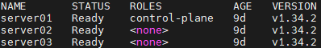

# dotnet-k8s-labs
Kubernetes 환경에서 .NET 서버를 구축 및 배포하기 위한 실습 레포지토리

---

## 도구 및 환경
- **Kubernetes**
  - VirtualBox 를 사용하여 Ubuntu24.04 기반 가상머신 3대로 클러스터 구성
  - 마스터 노드 1대, 워커 노드 2대

  

- **.NET**  
  - .Net 9.0
  - ASP.NET Core 컨트롤러 기반 API 서버

---
  
## 향후 계획
- 서버 확장
- 데이터베이스 구성
- 모니터링 툴 구성
- GitOps 구성
